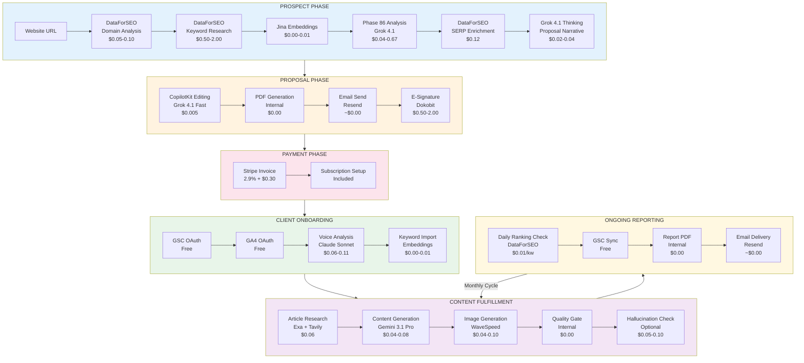
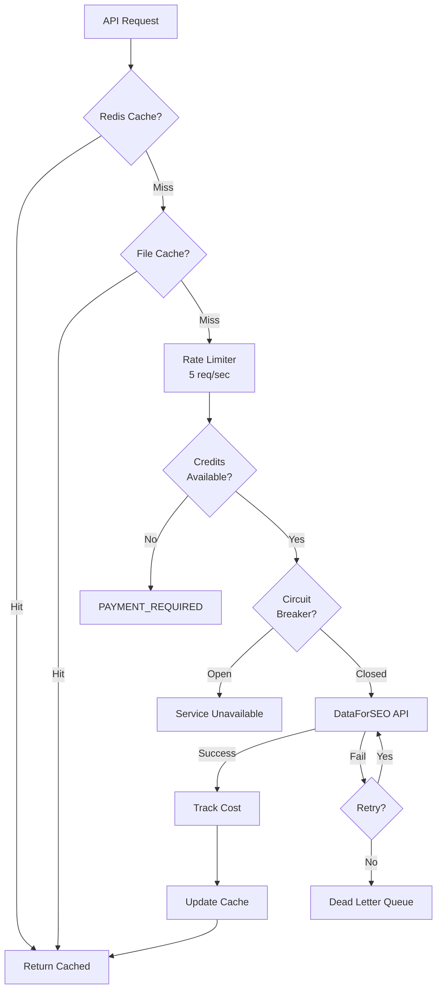
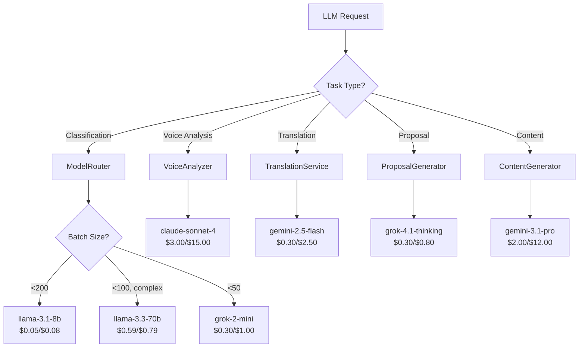
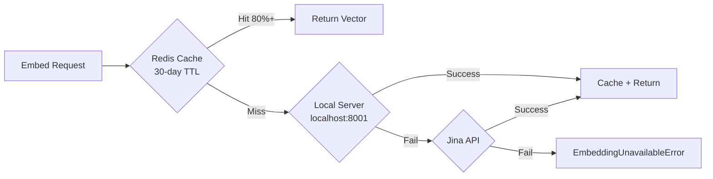
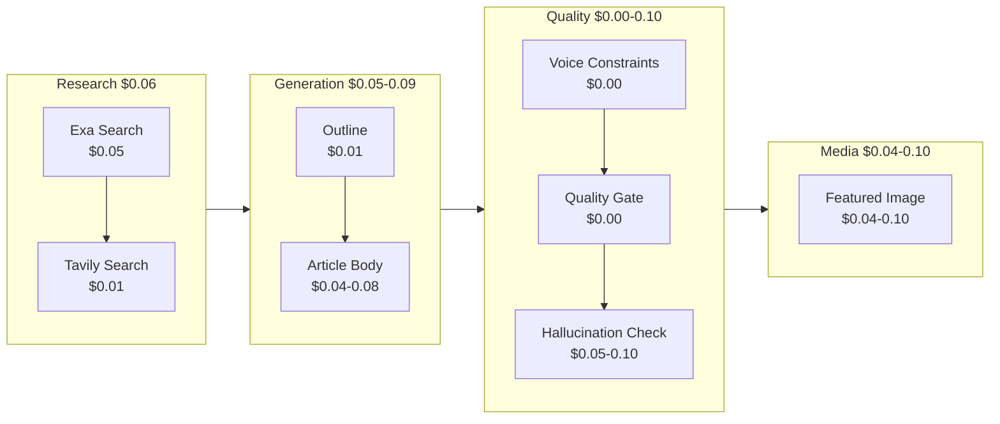
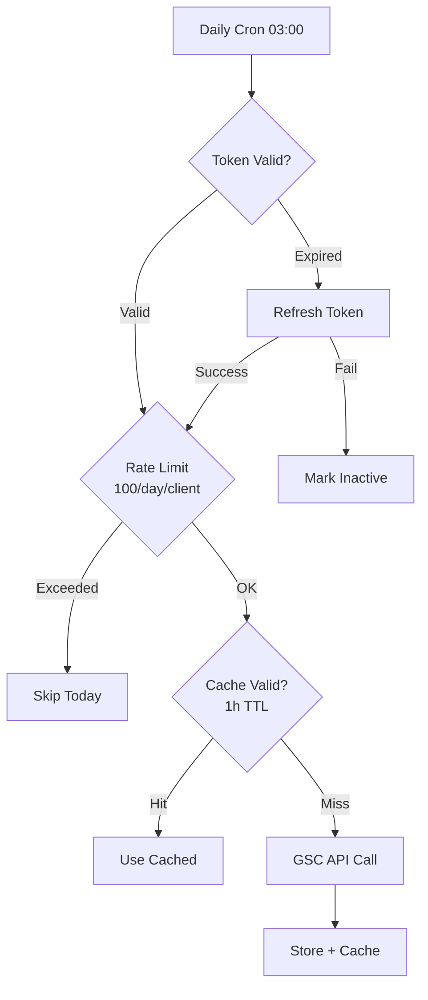
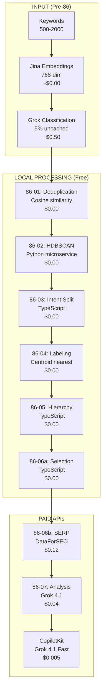
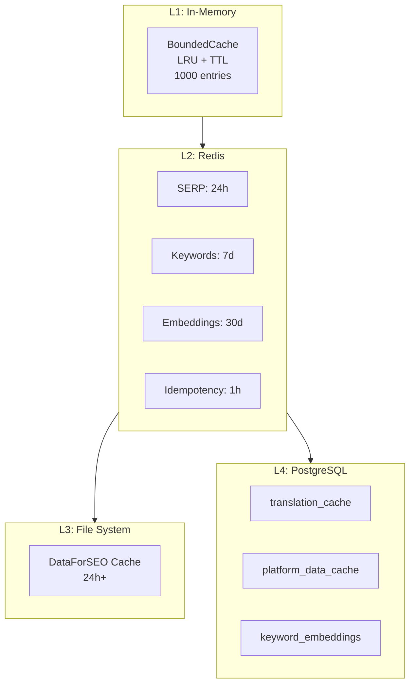

# TeveroSEO API Cost Analysis: Prospect-to-Client Journey

> Comprehensive documentation of all paid API calls, decision-making logic, caching strategies, and optimization opportunities across the entire platform.

---

## Table of Contents

1. [Executive Summary](#executive-summary)
2. [Journey Overview Diagram](#journey-overview-diagram)
3. [DataForSEO API Costs](#1-dataforseo-api-costs)
4. [LLM API Costs (Grok/Claude/Gemini)](#2-llm-api-costs)
5. [Embedding API Costs](#3-embedding-api-costs)
6. [AI-Writer Content Generation](#4-ai-writer-content-generation)
7. [Google APIs](#5-google-apis)
8. [Payment & Notification APIs](#6-payment--notification-apis)
9. [Phase 86 Pipeline Costs](#7-phase-86-semantic-intelligence-pipeline)
10. [Caching & Optimization Patterns](#8-caching--optimization-patterns)
11. [Cost Sinks & Recommendations](#9-cost-sinks--recommendations)

---

## Executive Summary

### Total Per-Prospect Analysis Cost

| Stage | API | Cost Range |
|-------|-----|------------|
| Keyword Research | DataForSEO | $0.50-2.00 |
| Keyword Analysis (Phase 86) | Grok + Embeddings | $0.04-0.67 |
| SERP Enrichment | DataForSEO | $0.12 |
| Proposal Generation | Grok 4.1 Thinking | $0.02-0.04 |
| **Total per Prospect** | | **$0.68-2.83** |

### Total Per-Article Cost

| Component | Cost Range |
|-----------|------------|
| Research (Exa + Tavily) | $0.06 |
| Content Generation (Gemini) | $0.04-0.08 |
| Featured Image | $0.04-0.10 |
| Quality Check (optional) | $0.05-0.10 |
| **Total per Article** | **$0.16-0.42** |

### Monthly Cost at Scale

| Scale | Prospects/mo | Articles/mo | Est. Monthly Cost |
|-------|--------------|-------------|-------------------|
| Starter | 50 | 100 | ~$100-200 |
| Growth | 200 | 500 | ~$400-800 |
| Scale | 1000 | 2000 | ~$2,000-4,000 |

---

## Journey Overview Diagram



---

## 1. DataForSEO API Costs

### Endpoint Inventory

| Endpoint | Trigger | Cost/Call | Caching |
|----------|---------|-----------|---------|
| `/v3/keywords_data/google_ads/search_volume/live` | Keyword enrichment | $0.005/kw | 7-day Redis |
| `/v3/dataforseo_labs/google/related_keywords/live` | Keyword research | $0.05-0.10 | 24h file |
| `/v3/dataforseo_labs/google/keyword_suggestions/live` | Keyword research | $0.05-0.10 | 24h file |
| `/v3/dataforseo_labs/google/domain_rank_overview/live` | Prospect analysis | $0.05 | 12h file |
| `/v3/dataforseo_labs/google/ranked_keywords/live` | Domain analysis | $0.05-0.10 | 12h file |
| `/v3/dataforseo_labs/google/keywords_for_site/live` | Prospect analysis | $0.05-0.10 | None |
| `/v3/dataforseo_labs/google/competitors_domain/live` | Prospect analysis | $0.05-0.10 | None |
| `/v3/dataforseo_labs/google/domain_intersection/live` | Keyword gap | $0.02-0.05 | None |
| `/v3/serp/google/organic/live/regular` | Daily ranking | $0.01-0.02 | 24h L1+L2 |
| `/v3/on_page/lighthouse/live/json` | Site audit | $0.00425 | None |
| `/v3/on_page/content_parsing/live` | SERP scraping | $0.02/page | None |
| `/v3/backlinks/summary/live` | Backlink analysis | Variable | None |
| `/v3/appendix/user_data` | Balance check | Free | None |

### Decision Flow



### Cost Sinks

1. **Daily Ranking Checks** - Every tracked keyword = SERP call ($0.01-0.02/kw)
2. **Prospect Analysis** - 4-5 API calls per prospect with no caching
3. **SERP Content Analysis** - 5 HTML fetches per keyword brief

### Optimization Opportunities

| Opportunity | Current | Recommended | Savings |
|-------------|---------|-------------|---------|
| Prospect cache | None | 24h cache | 40-60% |
| Ranking batch | Per-keyword | Batch by location | Minimal |
| SERP content TTL | 24h | 7 days | 50%+ |
| Backlinks cache | None | 24h cache | 50%+ |
| Lighthouse cache | None | 7-day cache | 70%+ |

---

## 2. LLM API Costs

### Model Pricing (per 1M tokens)

| Model | Provider | Input | Output | Use Case |
|-------|----------|-------|--------|----------|
| llama-3.1-8b-instant | Groq | $0.05 | $0.08 | Classification |
| llama-3.3-70b | Groq | $0.59 | $0.79 | Complex reasoning |
| grok-4.1-fast | xAI | $0.20 | $0.50 | Batch analysis |
| grok-4.1-thinking | xAI | $0.30 | $0.80 | Strategic reasoning |
| gemini-2.5-flash | Google | $0.30 | $2.50 | Translation |
| gemini-3.1-pro | Google | $2.00 | $12.00 | Content writing |
| claude-sonnet-4 | Anthropic | $3.00 | $15.00 | Voice analysis |
| gpt-4o-mini | OpenAI | $0.15 | $0.60 | Fallback |

### Model Router Decision Tree



### Per-Call Cost Estimates

| Call Site | Model | Purpose | Est. Cost |
|-----------|-------|---------|-----------|
| `GrokClassifier.classify()` | grok-4.1-fast | Keyword classification | $0.001-0.003 |
| `FunnelLLMClassifier.classifyBatch()` | grok-4.1 | Funnel stage (100kw) | $0.003-0.006 |
| `VoiceAnalyzer.analyzeVoice()` | claude-sonnet-4 | Brand voice extraction | $0.06-0.11 |
| `TranslationService.translate()` | gemini-2.5-flash | LT/EN translation | $0.0004-0.002 |
| `ProposalAIGenerationService` | claude-sonnet-4 | Proposal narrative | $0.11-0.25 |
| AI-Writer article | gemini-3.1-pro | 2500-word article | $0.15-0.50 |

### Caching Strategy

- **Classification cache**: Cross-tenant Redis, 95% hit rate at scale
- **Translation cache**: PostgreSQL with SHA256 hash key, permanent
- **LLM responses**: NOT cached (fresh responses required)
- **Singleflight**: Prevents duplicate concurrent calls for same input

---

## 3. Embedding API Costs

### Architecture



### Cost Comparison

| Backend | Model | Cost | Latency |
|---------|-------|------|---------|
| Local Server | jina-v5-nano (768-dim) | $0.00 | ~5ms |
| Jina API | jina-v5-nano (768-dim) | $0.02/1M tokens | ~50ms |

### Monthly Cost by Scale

| Volume | Jina API | Local Server | Savings |
|--------|----------|--------------|---------|
| 20K embeddings | $0.40 | $0.00 | 100% |
| 200K embeddings | $4.00 | $0.00 | 100% |
| 500K embeddings | $10.00 | $0.00 | 100% |

**Recommendation**: Deploy local embedding server to eliminate all Jina costs.

---

## 4. AI-Writer Content Generation

### Per-Article Cost Breakdown



### API Usage Table

| Step | API | Model | Cost |
|------|-----|-------|------|
| Research | Exa | Neural Search | $0.05 |
| Research | Tavily | Web Search | $0.01 |
| Outline | Gemini | gemini-2.5-flash | $0.01 |
| Article Body | Gemini | gemini-3.1-pro | $0.04-0.08 |
| Meta Description | Gemini | gemini-2.5-flash | $0.005 |
| Voice Constraints | Internal | TypeScript API | $0.00 |
| Quality Gate | Internal | open-seo API | $0.00 |
| Hallucination Check | Exa + Gemini | Optional | $0.05-0.10 |
| Featured Image | WaveSpeed | qwen-image | $0.05 |

### Image Generation Options

| Model | Provider | Cost | Quality |
|-------|----------|------|---------|
| qwen-image | WaveSpeed | $0.05 | Standard |
| ideogram-v3-turbo | WaveSpeed | $0.10 | High + text |
| flux-kontext-pro | WaveSpeed | $0.04 | Typography |
| FLUX.1-Krea-dev | HuggingFace | ~$0.05 | Alternative |

---

## 5. Google APIs

### Cost Summary

| API | Cost | Quotas | Notes |
|-----|------|--------|-------|
| GSC Search Analytics | **FREE** | 1,200 req/day | 1h Redis cache |
| GA4 Data API | **FREE** | 10,000 req/day | Platform cache table |
| Google OAuth | **FREE** | No limits | Proactive token refresh |
| Google Business Profile | **FREE** | Varies | Parallel fetch |
| Gemini 2.5 Flash | $0.30/$2.50 per 1M | 60 RPM free | Circuit breaker |
| Gemini 1.5 Pro | $1.25/$10 per 1M | 60 RPM free | Proposals only |

### GSC Sync Decision Logic



---

## 6. Payment & Notification APIs

### Per-Proposal Cost

| Component | Low | High |
|-----------|-----|------|
| Stripe (EUR 3k payment) | EUR 43.50 (SEPA) | EUR 58.30 (Card) |
| Dokobit signing | EUR 0.50 | EUR 4.00 |
| Resend emails | EUR 0.00 | EUR 0.02 |
| **Total** | **EUR 44.00** | **EUR 62.32** |

### Stripe Fee Comparison

| Method | Fee Structure | EUR 3k Example |
|--------|---------------|----------------|
| Card (EU) | 2.9% + EUR 0.30 | EUR 87.30 |
| SEPA Direct Debit | 1.5% | EUR 45.00 |

**Recommendation**: Use SEPA for 50% reduction in payment fees.

### Email Volume (Resend)

| Tier | Emails/mo | Cost |
|------|-----------|------|
| Free | 3,000 | $0 |
| Pro | 50,000 | $20/mo |
| Overage | +1,000 | $2.25 |

---

## 7. Phase 86 Semantic Intelligence Pipeline

### Full Pipeline with Costs



### Cost by Stage (10K Keywords)

| Stage | API | Volume | Cost |
|-------|-----|--------|------|
| Embeddings | Jina (cached) | 10K | ~$0.00 |
| Classification | Grok (5% miss) | 500 | ~$0.50 |
| Deduplication | Local | 10K | $0.00 |
| HDBSCAN | Local | 8.5K | $0.00 |
| Intent Split | Local | 50 clusters | $0.00 |
| Labeling | Local | 50 clusters | $0.00 |
| Hierarchy | Local | 50 clusters | $0.00 |
| Selection | Local | 300 kw | $0.00 |
| SERP Enrichment | DataForSEO | 200 kw | $0.12 |
| Grok Analysis | Grok 4.1 | 1 call | $0.04 |
| CopilotKit | Grok 4.1 Fast | 5 responses | $0.005 |
| **TOTAL** | | | **~$0.67** |

### Cache Impact on Cost

| Scenario | Cache Hit | Total Cost | Cost/Keyword |
|----------|-----------|------------|--------------|
| Cold start | 0% | ~$10.67 | $0.00107 |
| Growing | 70% | ~$3.67 | $0.00037 |
| Mature | 95% | ~$0.67 | $0.00007 |

---

## 8. Caching & Optimization Patterns

### Cache Layer Architecture



### Cache Inventory

| Cache | Key Pattern | TTL | Est. Savings |
|-------|-------------|-----|--------------|
| SERP Cache | `osm:serp:*` | 24h | 70-90% |
| Keyword Metrics | `osm:kw:*` | 7 days | 80-95% |
| Competitor Spy | `osm:competitor:*` | 24h | 60-80% |
| Embeddings | `osm:embed:*` | 30 days | 99% |
| Translation | PostgreSQL | Permanent | 95%+ |
| Platform Data | PostgreSQL | Variable | 50-70% |

### Circuit Breaker Configuration

| Service | Threshold | Recovery |
|---------|-----------|----------|
| DataForSEO | 5 failures | 120s |
| Anthropic | 3 failures | 60s |
| OpenAI | 3 failures | 60s |
| Jina AI | 5 failures | 60s |
| Redis | 5 failures | 30s |

### Rate Limits

| Endpoint | Limit | Window |
|----------|-------|--------|
| Keyword Enrich | 30 req | 60s |
| SERP Analyze | 20 req | 60s |
| Content Generate | 20 req | 60s |
| Brief Generate | 10 req | 60s |
| DataForSEO | 5 req/sec | Burst 5 |

---

## 9. Cost Sinks & Recommendations

### Top Cost Sinks

| Rank | Area | Monthly Cost (1000 prospects) | % of Total |
|------|------|-------------------------------|------------|
| 1 | Daily Ranking Checks | $300-600 | 25-35% |
| 2 | Content Generation | $200-500 | 20-30% |
| 3 | Prospect Analysis | $150-300 | 15-20% |
| 4 | Voice Analysis | $60-110 | 5-10% |
| 5 | SERP Enrichment | $120 | 5-10% |

### Optimization Recommendations

| Priority | Optimization | Current | Recommended | Monthly Savings |
|----------|--------------|---------|-------------|-----------------|
| P0 | Local embedding server | Jina API | Local | $10-100 |
| P0 | SEPA vs Card payments | Card (2.9%) | SEPA (1.5%) | 50% on fees |
| P1 | Prospect analysis cache | None | 24h cache | $60-120 |
| P1 | Classification cache | 70% hit | 95% hit | $150-300 |
| P2 | Ranking batch optimization | Per-kw | Batch | $30-60 |
| P2 | SERP content TTL | 24h | 7 days | $50-100 |
| P3 | Backlinks cache | None | 24h | $20-50 |
| P3 | Lighthouse cache | None | 7 days | $10-30 |

### Decision Logic Summary

```
ALWAYS CACHE:
- Keyword metrics (7 days) - stable data
- Embeddings (30 days) - deterministic
- Translations (permanent) - deterministic
- SERP analysis (24h) - relatively stable

NEVER CACHE:
- LLM responses for proposals - must be fresh
- Real-time ranking checks - need current data
- Authentication tokens - security risk

USE CIRCUIT BREAKERS:
- All external APIs
- Cross-service calls
- Database connections

USE RATE LIMITING:
- Per-client API endpoints
- Background job processing
- Authentication endpoints
```

---

## Appendix: Key Files

### DataForSEO
- `open-seo-main/src/server/lib/dataforseo.ts`
- `open-seo-main/src/server/lib/dataforseoClient.ts`
- `open-seo-main/src/server/lib/redis-rate-limiter.ts`

### LLM Services
- `open-seo-main/src/server/features/keywords/services/model-router.ts`
- `open-seo-main/src/server/features/keywords/services/provider-config.ts`
- `AI-Writer/backend/services/llm_providers/main_text_generation.py`

### Embeddings
- `open-seo-main/src/server/lib/embeddings/embedding-service.ts`
- `open-seo-main/src/server/features/keywords/services/ResilientEmbedding.ts`

### Caching
- `open-seo-main/src/server/lib/redis.ts`
- `open-seo-main/src/server/lib/circuit-breaker.ts`
- `open-seo-main/src/server/lib/cache/serp-cache.ts`

### Content Generation
- `AI-Writer/backend/services/article_generation_service.py`
- `AI-Writer/backend/services/llm_providers/gemini_provider.py`

---

*Generated by 8 parallel Opus agents analyzing the full TeveroSEO codebase.*
*Last updated: 2026-05-05*
