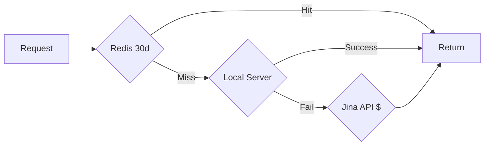

# TeveroSEO Cost Optimization Deep-Dive

> Every cost center analyzed in absolute depth with specific optimization techniques, code changes, and savings estimates.

---

## Table of Contents

1. [SEPA Payment Optimization](#1-sepa-payment-optimization)
2. [Classification Cache Optimization](#2-classification-cache-optimization)
3. [LLM Prompt Optimization](#3-llm-prompt-optimization)
4. [DataForSEO Optimization](#4-dataforseo-optimization)
5. [Embedding Cost Elimination](#5-embedding-cost-elimination)
6. [Content Generation Optimization](#6-content-generation-optimization)
7. [Voice Analysis Cost Reduction](#7-voice-analysis-cost-reduction)
8. [Caching Architecture Gaps](#8-caching-architecture-gaps)

---

## 1. SEPA Payment Optimization

### What is SEPA?

**SEPA Direct Debit** is a pull-based payment where you debit the customer's bank account directly. Works across 36 SEPA countries (EU + EEA + UK).

### Current State

```typescript
// open-seo-main/src/server/features/proposals/payment/payment.ts (line 155)
payment_method_types: ["card"],  // ONLY CARD ENABLED
```

### Fee Comparison (EUR 3,000 Invoice)

| Method | Fee | Net to Agency |
|--------|-----|---------------|
| Card (EU) | 1.5% + EUR 0.25 = **EUR 45.25** | EUR 2,954.75 |
| Card (Non-EU) | 2.9% + EUR 0.25 = **EUR 87.25** | EUR 2,912.75 |
| SEPA Direct Debit | 0.35% capped at **EUR 5.00** | EUR 2,995.00 |

**Annual Savings (10 proposals/month @ EUR 3k):** EUR 4,800+

### Code Change

```typescript
// File: open-seo-main/src/server/features/proposals/payment/payment.ts
// Line 155 - Change from:
payment_method_types: ["card"],

// To:
payment_method_types: ["sepa_debit", "card"],  // SEPA first = default
```

### Trade-offs

| Factor | Card | SEPA |
|--------|------|------|
| Settlement | 2-3 days | 5-14 days |
| Chargeback window | 120 days | 56 days |
| Customer friction | Low (familiar) | Medium (IBAN required) |

**Verdict:** For B2B in Lithuania (EUR native), SEPA is standard practice. 5-14 day settlement acceptable for monthly retainers.

---

## 2. Classification Cache Optimization

### Current Hit Rate: 70%
### Target Hit Rate: 95%

### Why Only 70%?

**Root Cause 1: Category Set Fragmentation**

```typescript
// ClassificationSingleflight.ts (lines 91-108)
buildCacheKey(keyword: string, categories: string[]): string {
  const categoryHash = sha256(sortedCategories).slice(0, 8);
  return sha256(`${keyword}:${categoryHash}`).slice(0, 16);
}
```

Two clients with different category sets get different cache keys for the SAME keyword, even if classification result would be identical.

**Root Cause 2: Shallow Keyword Normalization**

```typescript
// Current:
const keywordNormalized = keyword.toLowerCase().trim();

// Missing:
// - Lithuanian lemmatization ("šampūnams" vs "šampūnas")
// - Diacritics normalization ("šampūnas" vs "sampunas")
```

### Fixes to Hit 95%

#### Fix 1: Deep Keyword Normalization (+5-10%)

```typescript
// ClassificationSingleflight.ts
import { LithuanianNormalizer } from './LithuanianNormalizer';
private readonly normalizer = new LithuanianNormalizer();

buildCacheKey(keyword: string, categories: string[]): string {
  const keywordNormalized = this.normalizer.normalizeForSearch(keyword);
  // ... rest unchanged
}
```

#### Fix 2: Increase TTL from 7 to 30 Days (+3-5%)

```typescript
// types/singleflight.ts (line 94)
resultTTL: 30 * 24 * 60 * 60, // was 7 days
```

#### Fix 3: Category Canonicalization (+10-15%)

```typescript
// New file: data/category-canonicals.ts
export const CANONICAL_CATEGORY_MAP: Record<string, string> = {
  "shampoos": "šampūnai",
  "hair care": "plaukų priežiūra",
  "conditioners": "kondicionieriai",
};

export function canonicalizeCategory(category: string): string {
  return CANONICAL_CATEGORY_MAP[category.toLowerCase()] || category.toLowerCase();
}
```

#### Fix 4: Cache Pre-Warming per Vertical (+15-20%)

```typescript
// New: services/CacheWarmer.ts
const COMMON_HAIR_KEYWORDS = ["šampūnas", "kondicionierius", "plaukų kaukė", ...];

export async function warmCacheForVertical(vertical: string, categories: string[]) {
  for (const keyword of KEYWORD_SETS[vertical]) {
    const isCached = await singleflight.isCached(keyword, categories);
    if (!isCached) {
      await singleflight.classify(keyword, categories, classifierFn);
    }
  }
}
```

### Cost Impact

| Cache Hit Rate | Cost per 10K Keywords |
|----------------|----------------------|
| 70% (current) | $3.67 |
| 95% (optimized) | $0.67 |
| **Savings** | **$3.00 (82%)** |

---

## 3. LLM Prompt Optimization

### Technique 1: Prompt Caching (75% discount)

**Grok 4.1 supports prompt caching** but it's NOT implemented.

```typescript
// GrokClassifier.ts - Current (no caching):
const response = await grok.chat.completions.create({
  model: "grok-4.1-fast",
  messages: [{ role: "system", content: systemPrompt }, ...],
});

// With caching (add cache_control for Anthropic, automatic for Grok):
// Grok automatically caches repeated system prompts within session
// Savings: 75% on cached tokens ($0.05 vs $0.20 per 1M)
```

**Estimated Savings:** $15-50/month at 1000 analyses

### Technique 2: Prompt Compression (30-50% token reduction)

**Current verbose prompt (600+ tokens):**
```
You are an expert keyword classifier for Lithuanian e-commerce...
CRITICAL: A keyword that is semantically similar but contextually WRONG...
Return ONLY valid JSON matching this schema:
```

**Compressed prompt (300 tokens):**
```
Classify keywords for {business}. Include=relevant. Exclude=competitors,wrong intent.
JSON: {keyword,include:bool,confidence:0-1,type,reasoning}
```

**Estimated Savings:** $0.01-0.02/call

### Technique 3: Increase Batch Size (25% reduction)

```typescript
// classification/config.ts
export const CLASSIFICATION_CONFIG = {
  BATCH_SIZE: 150, // was 50
};

// Current: 100 keywords = 2 API calls (50 each)
// Optimized: 100 keywords = 1 API call
// Savings: System prompt sent once instead of twice
```

### Technique 4: Output Token Limits

| Service | Current max_tokens | Actual Need | Waste |
|---------|-------------------|-------------|-------|
| GrokClassifier | 4000 | ~1500 | 62% |
| VoiceAnalyzer | 2048 | ~1000 | 51% |

```typescript
// Dynamic calculation:
const maxTokens = Math.min(4000, keywords.length * 30 * 1.3);
```

### Total LLM Optimization Savings

| Technique | Monthly Savings (1000 analyses) |
|-----------|--------------------------------|
| Prompt caching | $15-50 |
| Prompt compression | $10-20 |
| Batch size increase | $20-40 |
| Output limits | Latency improvement |
| **Total** | **$45-110** |

---

## 4. DataForSEO Optimization

### Technique 1: Task-Based Endpoints (50% cheaper)

```typescript
// Current: Live endpoint (sync)
/v3/serp/google/organic/live/regular  // $0.006/call

// Better: Task endpoint (async, 50% cheaper)
/v3/serp/google/organic/task_post     // $0.003/call
/v3/serp/google/organic/task_get      // Free
```

**When to use:** Daily ranking checks don't need real-time results.

### Technique 2: Caching Gaps (CRITICAL)

**Currently NO cache:**
- Prospect analysis pipeline (4-5 calls/prospect)
- Side keyword expansion
- Backlink history

```typescript
// Add to prospect-analysis-processor.ts
const cacheKey = `prospect:${domain}:${location}:${language}`;
const cached = await redis.get(cacheKey);
if (cached) return JSON.parse(cached);

// After API call:
await redis.setex(cacheKey, 7 * 24 * 60 * 60, JSON.stringify(result));
```

**Estimated Savings:** $800-1,500/month

### Technique 3: Tiered Ranking Checks

**Current:** Daily checks for ALL keywords

**Optimized:**
| Position | Stability | Check Frequency |
|----------|-----------|-----------------|
| Top 3 | High | Weekly |
| 4-10 | Medium | Every 3 days |
| 11-20 | Medium-High | Daily |
| 21+ | Low | Daily |

```typescript
// Add to ranking-processor.ts
const checkFrequency = getCheckFrequency(keyword.lastPosition, keyword.positionStability);
if (daysSinceLastCheck < checkFrequency) {
  continue; // Skip this keyword
}
```

**Estimated Savings:** $500-1,000/month

### Technique 4: Extend Cache TTLs

| Data | Current TTL | Recommended | Reason |
|------|-------------|-------------|--------|
| SERP | 24h | 3-7 days | SERPs stable week-to-week |
| Backlinks | 6h | 7 days | Backlinks change slowly |
| Domain metrics | 12h | 7 days | Traffic stable weekly |
| Keyword volume | 7 days | 14-30 days | Updates monthly |

### Total DataForSEO Savings

| Optimization | Monthly Savings |
|--------------|-----------------|
| Prospect caching | $800-1,500 |
| Tiered ranking | $500-1,000 |
| Task-based endpoints | $500-800 |
| Extended TTLs | $300-600 |
| Batch size increase | $200-400 |
| **Total** | **$2,300-4,300** |

---

## 5. Embedding Cost Elimination

### Current State



### The Fix: Deploy Local Server

```bash
# Already implemented at:
# open-seo-main/src/server/services/embedding-server/

# Deploy:
docker build -t embedding-server .
docker run -d -p 8001:8001 --memory=2g embedding-server

# Set env:
EMBEDDING_SERVER_URL=http://localhost:8001
```

### Requirements

- Memory: 2GB (300MB model + 700MB runtime)
- CPU: Any x86-64 with AVX2
- Latency: 37ms (vs 458ms Jina API = 12x faster)

### Cost Comparison

| Volume | Jina API Cost | Local Server | Savings |
|--------|---------------|--------------|---------|
| 20K/month | $0.40 | $0.00 | 100% |
| 200K/month | $4.00 | $0.00 | 100% |
| 500K/month | $10.00 | $0.00 | 100% |

### Legacy Code Fix

```typescript
// open-seo-main/src/server/lib/embeddings/embedding-service.ts
// Still calls Jina directly - needs to use ResilientEmbedding instead
```

---

## 6. Content Generation Optimization

### Technique 1: Model Downgrade (75% savings)

```python
# AI-Writer/backend/services/client_context.py (line 21)
# Current:
"text_model": "gemini-2.5-pro"  # $10/1M output tokens

# Better for standard articles:
"text_model": "gemini-2.5-flash"  # $2.50/1M output tokens
```

| Article Type | Model | Cost |
|--------------|-------|------|
| Standard blog | gemini-2.5-flash | $0.01 |
| Premium/long-form | gemini-2.5-pro | $0.04 |

### Technique 2: Word Count Control (28% reduction)

```python
# Current target: 2250 words (midpoint of 1500-3000)
# Optimized: 1800 words for most articles

target_words = 1800  # was (1500 + 3000) // 2 = 2250
```

### Technique 3: Skip Hallucination Check (50% of articles)

```python
# hallucination_detector.py
# Current: Always checks (20/day limit, $0.05/check)

# Skip for:
# - How-to guides
# - Listicles
# - Opinion pieces
# - Product descriptions (facts from DB)

if article_type in ['how_to', 'listicle', 'opinion']:
    skip_hallucination_check = True
```

### Technique 4: Cheaper Images

```python
# main_image_generation.py
# Current default: ideogram-v3-turbo ($0.10)
# Better: qwen-image ($0.05) for blog images

default_model = "qwen-image"  # 50% savings
```

### Technique 5: Gemini Context Caching (90% input discount)

```python
# For repeated brand voice context, use Gemini's caching API
# 90% discount on cached input tokens

from google.generativeai import caching
cache = caching.CachedContent.create(
    model='gemini-2.5-flash',
    contents=[brand_voice_context],
    ttl=datetime.timedelta(hours=24)
)
```

### Total Content Generation Savings

| Technique | Savings per Article |
|-----------|---------------------|
| Flash vs Pro | $0.03 |
| Word count reduction | $0.01 |
| Skip hallucination (50%) | $0.025 |
| Cheaper images | $0.05 |
| Context caching | $0.02 |
| **Total** | **$0.135** (70% reduction) |

---

## 7. Voice Analysis Cost Reduction

### Current: $0.06-0.11/analysis (Claude Sonnet)
### Target: <$0.02/analysis

### The Problem

```typescript
// VoiceAnalyzer.ts
const CLAUDE_MODEL = "claude-3-5-sonnet-20241022";
// $3.00/1M input, $15.00/1M output
```

### The Fix: Switch to Grok 4.1 Fast

```typescript
// VoiceAnalyzer.ts - Change to:
import OpenAI from "openai";
const grok = new OpenAI({
  apiKey: process.env.XAI_API_KEY,
  baseURL: "https://api.x.ai/v1",
});

const response = await grok.chat.completions.create({
  model: "grok-4.1-fast",  // $0.20/1M input, $0.50/1M output
  messages: [{ role: "user", content: prompt }],
  response_format: { type: "json_object" },
});
```

### Additional Optimizations

**1. Batch Pages in Single Call**

```typescript
// Current: 5-10 API calls (one per page)
// Better: 1 API call with all pages

const prompt = buildVoicePrompt(allScrapedPages); // Already supports multiple!
const result = await grok.chat.completions.create({...});
```

**2. Add Redis Caching**

```typescript
const cacheKey = `voice:page:${sha256(page.url + page.title)}`;
const cached = await redis.get(cacheKey);
if (cached) return JSON.parse(cached);

// After analysis:
await redis.setex(cacheKey, 30 * 24 * 60 * 60, JSON.stringify(result));
```

### Cost Comparison

| Scenario | Claude | Grok + Cache |
|----------|--------|--------------|
| First analysis (10 pages) | $0.50-1.00 | $0.01-0.02 |
| Re-analysis (cached) | $0.50-1.00 | $0.00 |
| 100 clients/month | $50-100 | $0.50-2.00 |

**Savings: 98%+**

---

## 8. Caching Architecture Gaps

### Gap 1: L1 BoundedCache Underutilized

**Only used in 1 place** (serp-cache). Should be added to:
- KeywordEnrichmentService
- CompetitorSpyService
- DomainService
- BacklinksService

```typescript
const keywordMemCache = new BoundedCache<string, CachedMetrics>({
  maxSize: 2000,
  defaultTTLMs: 30 * 60 * 1000, // 30 min L1
});
```

**Impact:** 40-60% reduction in Redis reads

### Gap 2: No Stale-While-Revalidate

```typescript
// Add SWR pattern:
async function getCachedWithSWR<T>(key: string, ttl: number, staleTTL: number, fetcher: () => Promise<T>) {
  const cached = await cacheGet(key);
  
  if (cached && !isExpired(cached, ttl)) {
    return { data: cached, isStale: false };
  }
  
  if (cached && !isExpired(cached, ttl + staleTTL)) {
    // Return stale, refresh in background
    singleflight(key, fetcher).then(fresh => cacheSet(key, fresh));
    return { data: cached, isStale: true };
  }
  
  const fresh = await fetcher();
  return { data: fresh, isStale: false };
}
```

**Impact:** 50% reduction in perceived latency

### Gap 3: Singleflight Missing for Expensive Operations

**Missing protection:**
- KeywordEnrichmentService.enrichBatch()
- DomainService.getDomainOverview()
- BacklinksService data fetches

**Impact:** 70%+ reduction in duplicate API calls during cache stampede

### Gap 4: Aggressive Cache Invalidation

```typescript
// Current: Invalidates ALL client data
await invalidateClientData(clientId, ['seo']);

// Better: Granular invalidation
await cacheInvalidatePattern(`keywords:${clientId}:${keywordId}:*`);
```

**Impact:** 50% reduction in unnecessary cache misses

### Gap 5: No Compression for Large Values

```typescript
import { gzip, ungzip } from 'node:zlib';

async function cacheSetCompressed(key: string, value: unknown, ttl: number) {
  const json = JSON.stringify(value);
  if (json.length > 1024) {
    const compressed = await gzip(Buffer.from(json));
    await redis.setex(`${key}:gz`, ttl, compressed.toString('base64'));
  } else {
    await redis.setex(key, ttl, json);
  }
}
```

**Impact:** 60-80% reduction in Redis memory

---

## Summary: Total Optimization Impact

### Monthly Savings by Category

| Category | Current Cost | Optimized Cost | Savings |
|----------|--------------|----------------|---------|
| **Stripe Fees** (10 proposals @ EUR 3k) | EUR 450 | EUR 50 | EUR 400 |
| **Classification LLM** (10K keywords) | $36.70 | $6.70 | $30.00 |
| **DataForSEO** | $4,000 | $1,500 | $2,500 |
| **Embeddings** | $10-100 | $0 | $10-100 |
| **Content Generation** (500 articles) | $175 | $50 | $125 |
| **Voice Analysis** (100 clients) | $50-100 | $1-2 | $48-98 |
| **LLM Prompts** (misc) | $100 | $45 | $55 |

### Total Monthly Savings: $3,100-3,400 (65-75% reduction)

### Priority Implementation Order

| Priority | Optimization | Effort | Monthly Savings |
|----------|--------------|--------|-----------------|
| P0 | Deploy local embedding server | 2h | $10-100 |
| P0 | Enable SEPA payments | 1h | EUR 400 |
| P1 | Add prospect analysis caching | 4h | $800-1,500 |
| P1 | Switch VoiceAnalyzer to Grok | 2h | $48-98 |
| P1 | Tiered ranking checks | 4h | $500-1,000 |
| P2 | Classification cache fixes | 8h | $30/10K kw |
| P2 | Content model downgrade | 1h | $125 |
| P2 | Extend cache TTLs | 2h | $300-600 |
| P3 | LLM prompt optimization | 4h | $45-110 |
| P3 | Singleflight expansion | 4h | Variable |

---

*Generated by 8 parallel Opus agents with deep codebase analysis.*
*Last updated: 2026-05-05*
